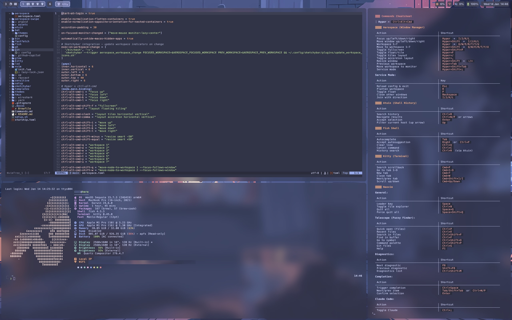

# Dededecline's Dotfiles

Personal dotfiles managed as a git repository in `~/.config`.




## Quick Start

### Fresh Install (New Machine)

Installs Xcode CLT and Homebrew if needed:

```bash
curl -fsSL https://raw.githubusercontent.com/dededecline/dotfiles/main/setup.sh | bash
```

### Existing Installation

```bash
./setup.sh                      # Run full setup (auto-detects from hostname)
./setup.sh --hostname athena    # Override hostname
./setup.sh --wallpaper          # Override wallpaper
./setup.sh --brew               # Sync Homebrew packages only
./setup.sh --macos              # Apply macOS preferences only
./setup.sh --help               # Show all options
```

The setup script is fully idempotent. Run it anytime to ensure everything is
configured correctly.

## Multi-Machine Support

The setup supports multiple machines with hostname-based configuration. Hostname
is auto-detected. Override with `--hostname <name>`.

### Machine-Specific Packages

Packages are organized under `.system/profiles/`:

```text
.system/profiles/
├── profiles.toml            # Machine-to-group membership (sole source of truth)
├── labels/
│   ├── all/Brewfile         # All machines
│   ├── ...
└── machines/
    ├── ...
```

## Secrets Management

Secrets are managed using 1Password CLI with template injection:

```bash
secrets                  # Inject all secrets from 1Password
secrets check            # Check which secrets are configured
```

### Template System

1. **Templates** (`.system/templates/*.tpl`) contain
   `{{ op://Vault/Item/Field }}` references
2. **secrets.sh** processes templates via `op inject`
3. **Output** goes to `.system/sensitive/` (gitignored)

## Process Management

Reload configured processes after making config changes:

```bash
refresh                  # Reload all configured processes (fish, aerospace, sketchybar, tmux)
refresh fish             # Reload Fish shell config only
refresh aerospace        # Reload Aerospace window manager only
refresh sketchybar       # Reload Sketchybar status bar only
refresh tmux             # Reload Tmux config only (if in tmux session)
```

The `refresh` command is useful after editing dotfiles to apply changes
immediately without restarting applications.
