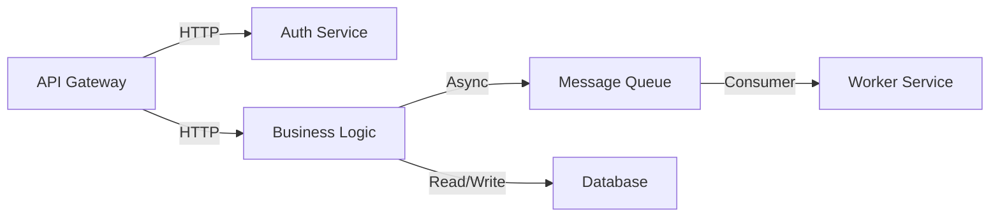

# Architecture Documentation

Generate docs/architecture.md documenting THIS REPOSITORY's technical architecture and internal structure.

## Scope

CRITICAL: Repository-Specific Focus**

This document focuses on **how THIS REPOSITORY is structured internally**, not the entire system architecture. Document:

- How THIS repo's code is organized
- What architectural patterns THIS repo follows
- How components within THIS repo interact
- What infrastructure/dependencies THIS repo uses
- How data flows through THIS repo's components

**Do NOT document**:

- The entire system's microservice architecture (unless this repo IS the entire system)
- Other repositories' internal architecture
- System-wide infrastructure (only what THIS repo directly uses)

**Before writing, you MUST**:

1. Understand what type of component this repo is (service, library, frontend, backend, etc.)
2. Explore THIS repo's directory structure and component organization
3. Identify what architectural patterns THIS repo implements
4. If this repo is part of a larger system, clearly state its role and boundaries

## Required Sections

### 1. Repository Overview

- **Repository Type**: What is THIS repo? (e.g., "Backend API service", "React frontend application", "Shared utility library", "Lambda functions")
- **Architectural Pattern**: What pattern does THIS repo follow? (MVC, layered architecture, clean architecture, component-based, etc.)
- **Technology Stack**: Languages, frameworks, and runtime environments used in THIS repo
- **Role in System**: How does THIS repo fit into the larger system? What does it do vs. what other services/repos handle?
- **Design Philosophy**: Key architectural principles THIS repo follows (DDD, CQRS, separation of concerns, etc.)

### 2. Component Architecture Within This Repo

**High-Level Components in This Repo:**

Document major components **within THIS repository** and their responsibilities:

```md
### API Layer
**Purpose**: HTTP request handling and routing
**Location**: src/api/
**Dependencies**: Authentication service, rate limiter
**Technologies**: Express.js, OpenAPI validation
**Key Patterns**: Middleware-based request pipeline
```

**Component Interactions Within This Repo:**

Use Mermaid diagrams to show how components **within THIS repo** interact:

- How THIS repo's internal components communicate
- Synchronous vs. asynchronous interactions within THIS repo
- Error handling patterns within THIS repo
- External dependencies THIS repo integrates with (clearly marked as external)



### 3. Data Flow Architecture in This Repo

**Request Lifecycle Within This Repo:**

Document how requests/data flow through THIS repository's components:

```txt
1. Client Request → Load Balancer
2. Load Balancer → API Gateway
3. API Gateway → Authentication Middleware
4. Authentication → Authorization Check
5. Authorization → Route Handler
6. Route Handler → Service Layer
7. Service Layer → Repository/Data Access
8. Repository → Database
9. Response reverses through layers
```

**Background Processing:**

- Job queue architecture (Redis Queue, BullMQ, Celery, etc.)
- What triggers background jobs vs. synchronous processing
- Job priority and scheduling patterns
- Failure handling and retry strategies

**Event-Driven Flows:**

If applicable:

- Event bus/message broker (Kafka, RabbitMQ, SNS/SQS, etc.)
- Event schemas and versioning
- Publishers and subscribers
- Event ordering and delivery guarantees

### 4. Infrastructure & Dependencies Used by This Repo

**Data Storage Used by This Repo:**

Only document storage systems THIS repo directly interacts with:

- **Primary Database**: Type, how THIS repo connects, connection pooling in THIS repo
- **Cache Layer**: How THIS repo uses Redis/Memcached, invalidation strategies THIS repo implements
- **Object Storage**: How THIS repo interacts with S3/blob storage
- **Search Indices**: How THIS repo integrates with search systems

**Authentication & Authorization:**

- Authentication mechanism (JWT, OAuth, session-based, etc.)
- Token lifecycle and refresh patterns
- Authorization model (RBAC, ABAC, custom)
- Service-to-service authentication
- Third-party identity providers

**External Integrations:**

- HTTP clients and connection management
- API rate limiting and circuit breakers
- Webhook handlers and signature verification
- Third-party service SDKs and clients

**Observability:**

- Logging framework and structured logging patterns
- Metrics collection (Prometheus, CloudWatch, Datadog)
- Distributed tracing (OpenTelemetry, Jaeger)
- Error tracking (Sentry, Rollbar)

### 5. Directory Structure of This Repo

Provide a map of THIS repository's codebase with purpose descriptions:

```txt
src/
├── api/              # HTTP controllers and route definitions
├── services/         # Business logic layer
├── repositories/     # Data access layer
├── models/           # Domain entities and schemas
├── middleware/       # Request pipeline middleware
├── lib/              # Shared utilities and helpers
├── config/           # Configuration management
└── workers/          # Background job processors

tests/
├── unit/             # Unit tests
├── integration/      # Integration tests
└── e2e/              # End-to-end tests
```

### 6. Deployment Architecture for This Repo

**How This Repo is Deployed:**

- How THIS repo is deployed to different environments
- Environment-specific configurations for THIS repo
- How THIS repo accesses secrets (AWS Secrets Manager, Vault, environment variables)

**Deployment Model for This Repo:**

- How THIS repo is containerized (Docker configuration in THIS repo)
- Where THIS repo runs (K8s, ECS, Lambda, etc.)
- THIS repo's CI/CD pipeline
- Deployment strategies for THIS repo
- Rollback procedures for THIS repo

**Scalability of This Repo:**

- How THIS repo scales (horizontal/vertical)
- Load balancing for THIS repo's instances
- Auto-scaling configuration for THIS repo
- How THIS repo handles database scaling
- Whether THIS repo is stateless or stateful

**Infrastructure as Code:**

- Terraform, CloudFormation, or other IaC tools
- Key infrastructure resources
- Network topology (VPCs, subnets, security groups)

### 7. Performance Considerations

- Caching strategies at different layers
- Database query optimization patterns
- Connection pooling configurations
- Rate limiting implementation
- Resource limits and quotas

### 8. Security Architecture

- Network security (firewalls, security groups)
- Data encryption (at rest, in transit)
- Secrets rotation policies
- Security scanning and vulnerability management
- Compliance requirements (GDPR, HIPAA, SOC2)

## Formatting Guidelines

- Use Mermaid diagrams for component interactions and data flows
- Link to related documentation (api_design.md, data_model.md, features.md)
- Include file paths to key architectural components
- Use code blocks for configuration examples
- Create tables for comparison of patterns or environments

## What NOT to Include

- **Other repositories' architecture**: Only document THIS repo's internal architecture
- **System-wide architecture**: Unless THIS repo IS the entire system, don't document the full microservice architecture
- **Other services' infrastructure**: Only document infrastructure THIS repo directly uses
- Implementation details of specific functions (save for code comments)
- Complete configuration file contents (link to them instead)
- Detailed API endpoint specifications (that's api_design.md)
- Database schema details (that's data_model.md)
- Step-by-step feature workflows (that's features.md)

## Output

Write the complete document to `docs/architecture.md` following this structure, **focusing specifically on THIS REPOSITORY's internal architecture**.

**Key Principles**:

1. **Repo-specific focus**: Document only THIS repo's architecture, not the entire system
2. **Internal focus**: Emphasize how THIS repo is structured internally
3. **Clear boundaries**: When mentioning external systems, clearly mark them as external dependencies
4. **Concrete examples**: Use actual directory paths and component names from THIS repo

**Before you start writing**:

- Explore THIS repo's directory structure
- Identify the architectural patterns THIS repo uses
- Understand THIS repo's role in the larger system
- Document only components and infrastructure within or directly used by THIS repo

**IMPORTANT - Last Updated Header:**

Before writing the document, run the following bash command to get the current date:

```bash
date +"%B %d, %Y"
```

Add a "Last Updated" header at the very top of the document using the date from the bash command:

```md
# Architecture Documentation

**Last Updated:** [Date from bash command]

[Rest of document content...]
```
