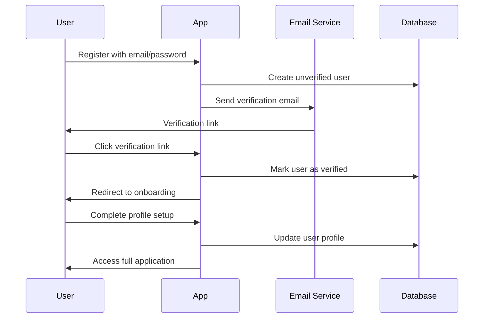
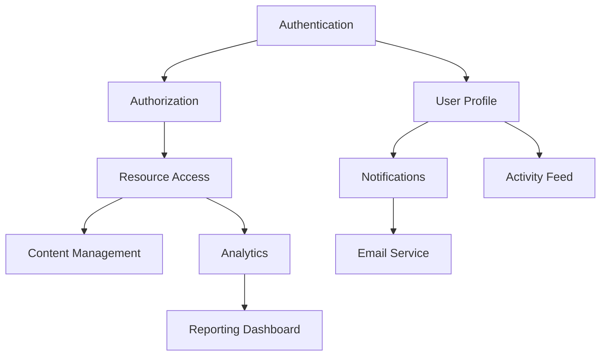

# Feature Documentation

Generate docs/features.md documenting the features and capabilities implemented in THIS SPECIFIC REPOSITORY.

## Scope

CRITICAL: Repository-Specific Focus**

This document focuses on **features implemented in THIS REPOSITORY ONLY**, not the overall product or application.

**Before writing, you MUST**:

1. Understand this repository's purpose and scope
2. Identify what capabilities/features THIS repo implements
3. Determine THIS repo's role in the larger system (e.g., "Frontend UI", "Authentication service", "Data processing pipeline", "Shared library")

**Examples of repo-specific feature documentation**:

- If this is a **frontend repo**: Document UI components, user interactions, forms, pages this repo implements
- If this is a **backend API**: Document endpoints, business logic, data processing this repo provides
- If this is a **shared library**: Document utilities, helpers, components this repo exports
- If this is a **worker/job service**: Document background jobs, scheduled tasks, data processing this repo performs

**Do NOT document**:

- Features from other repositories
- The entire application's feature set
- Features this repo consumes from other services (unless explaining how this repo uses them)

## Required Sections

### 1. Repository Overview

- **Repository Purpose**: What does THIS repo do? What capabilities does it provide?
- **Repository Type**: What kind of component is this? (Frontend, backend service, library, worker, etc.)
- **Target Users of This Repo's Features**: Who directly benefits from what THIS repo implements?
- **Key Capabilities**: What are the main things THIS repo enables or provides?
- **Role in System**: How does THIS repo fit into the larger product/system?

### 2. Feature Catalog for This Repo

Document each major feature **implemented in THIS REPOSITORY** with comprehensive details:

```md
### [Feature Name - implemented in THIS repo]

**Purpose**: What capability does THIS repo provide?

**What This Repo Implements**: Be specific about what THIS repo's code does (vs. what other repos do)

**Location in This Repo**:
- Controllers/Components: src/[relevant path]
- Services/Logic: src/[relevant path]
- Models/Types: src/[relevant path]

**Capabilities Provided by This Repo**:
- [List what THIS repo's code enables]
- [Be specific about what's implemented here vs. elsewhere]

**Key Endpoints/APIs/Components in This Repo** (if applicable):
- [List endpoints/exports/components THIS repo provides]
- [Skip if this repo doesn't expose APIs/exports]

**Business Rules**:
- Passwords must meet complexity requirements (see src/validators/password.ts)
- Account lockout after 5 failed login attempts
- Sessions expire after 24 hours of inactivity
- Email verification required before full account access

**Dependencies This Repo Uses**:
- [External services/APIs THIS repo calls]
- [Other repos/services THIS repo depends on]
- [Infrastructure THIS repo requires]

**Configuration**:
- Feature flags: `ENABLE_SOCIAL_LOGIN`, `REQUIRE_EMAIL_VERIFICATION`
- Environment: `JWT_SECRET`, `SESSION_TIMEOUT_HOURS`

**Related Docs**: See api_design.md for `/auth/*` endpoints, data_model.md for User entity
```

### 3. User Flows Involving This Repo

Document flows where THIS REPOSITORY's code is involved:

**New User Onboarding:**



**Include flows for:**

- Primary user journeys (signup to first value)
- Critical business processes
- Error recovery paths
- Admin/support workflows

### 4. Feature Interactions & Dependencies in This Repo

**Feature Dependency Map Within This Repo:**

Show how features **within THIS repo** depend on or interact with each other, and what external dependencies they have:



**Interaction Patterns:**

| Feature A (in this repo) | Feature B | Interaction Type | Description |
|--------------------------|-----------|------------------|-------------|
| [This repo's feature] | [Another feature in this repo] | Internal | How they interact within this repo |
| [This repo's feature] | [External service/repo] | External Dependency | How this repo uses external service |
| [This repo's feature] | [Another external service] | Integrates With | Integration this repo implements |

### 5. Business Logic Highlights in This Repo

Document important business rules, calculations, or algorithms **implemented in THIS REPOSITORY**:

**Pricing Calculation:**

```txt
Location: src/services/pricing/calculator.ts

Logic:
1. Base price determined by product tier
2. Volume discount applied for quantities > 10 (10% off)
3. Enterprise customers get additional 15% discount
4. Promotional codes applied after all other discounts
5. Tax calculated based on customer billing address
6. Currency conversion uses daily exchange rates cached at midnight UTC

Example:
Base: $100
Quantity: 15 → Volume discount: -$10
Enterprise: -$13.50
Promo (SAVE20): -$15.30
Subtotal: $61.20
Tax (8%): $4.90
Total: $66.10
```

**Data Retention:**

- User data retained for 7 years per regulatory requirements
- Soft deletes used for user-created content
- Hard delete after 90 days in "deleted" state
- Audit logs retained indefinitely

**Rate Limiting:**

- Free tier: 100 requests/hour
- Pro tier: 1000 requests/hour
- Enterprise: Custom limits
- Burst allowance: 2x sustained rate for 60 seconds

### 6. Feature Flags & Configuration

**Feature Flags:**

Document toggleable features and their purposes:

| Flag Name | Default | Purpose | Affects |
|-----------|---------|---------|---------|
| `ENABLE_SOCIAL_LOGIN` | true | Enable OAuth providers | Login page, registration |
| `NEW_DASHBOARD_UI` | false | A/B test new dashboard | Dashboard route |
| `REQUIRE_EMAIL_VERIFICATION` | true | Force email verification | Registration flow |

**Environment-Based Behavior:**

- **Development**: Mock external services, detailed error messages
- **Staging**: Full external integrations, verbose logging
- **Production**: Real services, error obfuscation, rate limiting active

### 7. External Integrations from This Repo

**For each external service THIS REPO integrates with:**

```md
### Stripe Payment Processing

**Provider**: Stripe API v2
**Purpose**: Credit card processing and subscription management
**Used By**: Billing feature, subscription management
**Authentication**: API key (env: STRIPE_SECRET_KEY)
**Key Operations**:
- Create customer
- Process payment
- Manage subscriptions
- Handle webhooks for payment status
**Webhooks**: POST /api/v1/webhooks/stripe
**Rate Limits**: 100 requests/second
**Failure Handling**: Automatic retry with exponential backoff
**Monitoring**: Alert on webhook delivery failures
```

### 8. Feature Limitations & Known Issues in This Repo

- Document current limitations in THIS repo's features
- Known bugs or technical debt in THIS repo
- Features THIS repo partially implements
- Deprecated features in THIS repo and migration paths

### 9. Roadmap & Upcoming Features for This Repo

- Features currently in development in THIS repo
- Planned enhancements to THIS repo's features
- Experimental features in THIS repo behind flags

## Formatting Guidelines

- Use Mermaid sequence diagrams for user flows
- Use Mermaid flowcharts for feature dependencies
- Link to related documentation (architecture.md, api_design.md, data_model.md)
- Include file paths to feature implementations
- Use tables for feature comparisons and flag documentation
- Provide code examples for complex business logic

## What NOT to Include

- **Features from other repositories**: Only document features THIS repo implements
- **Overall application feature set**: Focus only on what THIS repo contributes
- **Features this repo consumes**: Only document what THIS repo provides, not what it uses from others
- Low-level implementation details (that's code comments)
- API request/response schemas (that's api_design.md)
- Database schemas (that's data_model.md)
- Infrastructure details (that's architecture.md)
- Every minor helper function or utility

## Output

Write the complete document to `docs/features.md` following this structure, **focusing specifically on features implemented in THIS REPOSITORY**.

**Key Principles**:

1. **Repo-specific focus**: Only document features THIS repo implements
2. **Clear scope**: Clearly state what THIS repo does vs. what other repos/services do
3. **Concrete examples**: Use actual file paths and component names from THIS repo
4. **Role clarity**: Explain THIS repo's role in the larger system

**Before you start writing**:

- Explore the codebase to understand what features THIS repo implements
- Identify THIS repo's type (frontend, backend, library, worker, etc.)
- Document only capabilities provided by THIS repo's code

**IMPORTANT - Last Updated Header:**

Before writing the document, run the following bash command to get the current date:

```bash
date +"%B %d, %Y"
```

Add a "Last Updated" header at the very top of the document using the date from the bash command:

```md
# Feature Documentation

**Last Updated:** [Date from bash command]

[Rest of document content...]
```
