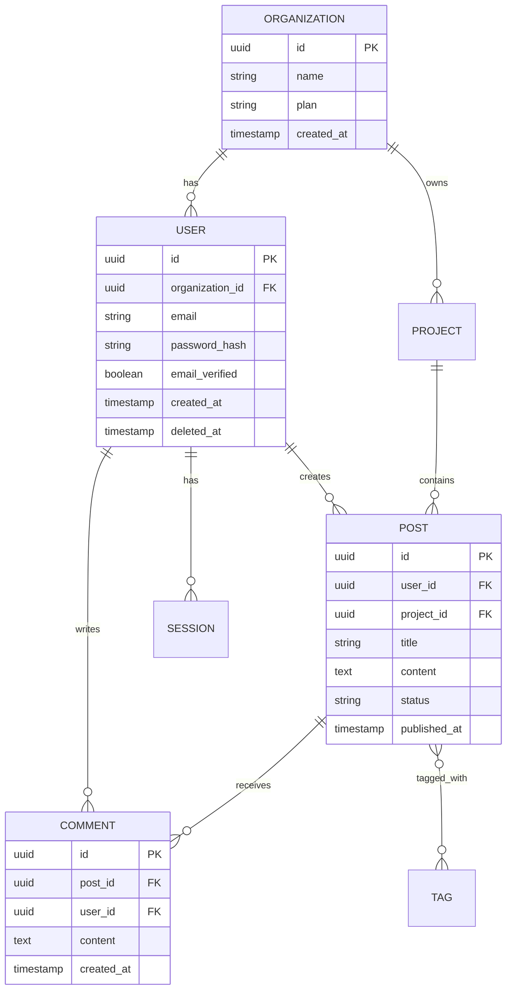

# Data Model Documentation

Generate docs/data_model.md documenting the data structures and schemas defined or used in THIS SPECIFIC REPOSITORY.

## Scope

CRITICAL: Repository-Specific Focus**

This document focuses on **data structures defined or managed by THIS REPOSITORY**, not the entire system's data model.

**Before writing, you MUST**:

1. Understand what data THIS repo defines, owns, or manages
2. Identify if THIS repo defines database schemas, API types, or data structures
3. Determine THIS repo's role in data management (owns database tables, defines types, uses external schemas, etc.)

**Different repo types, different data model docs**:

- **Backend API with database**: Document tables/collections THIS repo owns
- **Frontend application**: Document TypeScript types, API response shapes, state management schemas
- **Shared library**: Document exported types, interfaces, data structures
- **Worker/job service**: Document job payloads, queue message schemas
- **No data ownership**: If this repo doesn't define data structures, skip this doc or state it clearly

**Do NOT document**:

- Data models from other repositories (unless THIS repo consumes them, and you're documenting the interface)
- The entire database schema of the system (only tables THIS repo owns)
- External API schemas (unless THIS repo defines them)

## Required Sections

### 1. Data Overview for This Repo

**What Data Does This Repo Own/Define?**

First, clearly state what data THIS repository is responsible for:

- Does THIS repo define database tables/collections? Which ones?
- Does THIS repo define TypeScript types/interfaces? What are they?
- Does THIS repo define API schemas (GraphQL types, Protobuf messages, OpenAPI schemas)?
- Does THIS repo define message/event schemas for queues?

**Database Systems This Repo Uses** (if applicable):

Only document databases THIS repo directly accesses:

- **Primary Database**: What database does THIS repo connect to? What tables does it own?
- **Additional Stores**: What other storage does THIS repo use? (Cache, search, etc.)
- **Data Partitioning**: How does THIS repo implement sharding/partitioning?

**Connection & Access in This Repo** (if applicable):

Only document if THIS repo connects to a database:

- How THIS repo configures connection pooling
- Read/write splitting THIS repo implements
- Connection retry/timeout strategies in THIS repo
- ORM/ODM THIS repo uses

**Migration Strategy:**

- Migration tool (Knex, Alembic, Flyway, etc.)
- Migration process and versioning
- Rollback procedures
- Schema change approval process

### 2. Data Structures Defined in This Repo

Document each major entity/table/type **that THIS REPOSITORY defines or owns**:

```md
### [Entity/Type Name]

**Defined in This Repo**: Where in THIS repo is this defined?
- For database tables: **Table/Collection**: `table_name`
- For TypeScript types: **Type/Interface**: `TypeName` in `src/types/file.ts`
- For GraphQL: **GraphQL Type**: `TypeName` in `schema.graphql`

**Purpose**: What does THIS repo use this data structure for?

**Schema Location in This Repo**: src/models/user.ts or migrations/001_create_users.sql

**Key Fields**:

| Field | Type | Constraints | Description |
|-------|------|-------------|-------------|
| `id` | UUID | PRIMARY KEY | Unique identifier |
| `email` | VARCHAR(255) | UNIQUE, NOT NULL, INDEXED | User login email |
| `password_hash` | VARCHAR(255) | NOT NULL | Bcrypt hashed password |
| `email_verified` | BOOLEAN | DEFAULT false | Email verification status |
| `created_at` | TIMESTAMP | NOT NULL | Account creation date |
| `updated_at` | TIMESTAMP | NOT NULL | Last modification date |
| `deleted_at` | TIMESTAMP | NULL | Soft delete timestamp |
| `organization_id` | UUID | FOREIGN KEY, INDEXED | Reference to organization |
| `role` | ENUM | NOT NULL | User role (admin, member, viewer) |

**Relationships**:
- [List relationships to other entities THIS repo defines]
- [Mark external relationships: "Refers to `organizations` (owned by another repo/service)"]
- [Only document relationships THIS repo manages]

**Indexes**:
- Primary: `id` (clustered)
- Secondary: `email` (unique)
- Secondary: `organization_id, created_at` (composite)
- Secondary: `deleted_at` (partial, WHERE deleted_at IS NULL)

**Validation Rules**:
- Email must be valid format (regex: `^[^\s@]+@[^\s@]+\.[^\s@]+$`)
- Password must be 8-72 characters (enforced in application)
- Role must be one of: 'admin', 'member', 'viewer'

**Data Lifecycle in This Repo**:
- Created: When/how does THIS repo create this data?
- Updated: When/how does THIS repo update this data?
- Deleted: How does THIS repo handle deletion?
- [If other repos also modify this data, mention the boundary]

**Performance Considerations**:
- Email lookups are frequent (cached in Redis for 5 minutes)
- Organization queries use composite index
- Soft delete queries use partial index for active users
```

### 3. Entity Relationship Diagrams for This Repo

Use Mermaid ER diagrams to show relationships **between entities THIS REPO defines**. Clearly mark external entities:



### 4. Relationships & Associations in This Repo

**Relationship Types for Entities This Repo Owns:**

Only document relationships between entities THIS repo defines/manages:

| Parent Entity | Child Entity | Type | Foreign Key | Cascade Behavior |
|---------------|--------------|------|-------------|------------------|
| Organization | User | 1:N | user.organization_id | RESTRICT (cannot delete org with users) |
| User | Post | 1:N | post.user_id | SET NULL (preserve posts, mark orphaned) |
| Post | Comment | 1:N | comment.post_id | CASCADE (delete comments with post) |
| User | Session | 1:N | session.user_id | CASCADE (delete sessions with user) |
| Post | Tag | N:M | post_tags junction | CASCADE (delete associations) |

**Many-to-Many Associations:**

```md
### Posts ↔ Tags

**Junction Table**: `post_tags`

| Field | Type | Constraints | Description |
|-------|------|-------------|-------------|
| `post_id` | UUID | FK, PK composite | Reference to posts |
| `tag_id` | UUID | FK, PK composite | Reference to tags |
| `created_at` | TIMESTAMP | NOT NULL | When tag was applied |

**Indexes**:
- Primary: `(post_id, tag_id)` (composite)
- Secondary: `tag_id` (for reverse lookups)
```

### 5. Data Integrity & Constraints in This Repo

**Constraints This Repo Enforces:**

Document constraints on data structures THIS repo defines:

- **Database-Level** (if this repo owns DB tables): Foreign keys, unique constraints, check constraints
- **Application-Level** (if this repo validates data): Validation rules in THIS repo's code
- **Type-Level** (if TypeScript/typed language): Type constraints THIS repo defines

**Application-Level Validation:**

Document validations enforced in application code:

```md
**User Validation** (src/validators/user.ts):
- Email format validation
- Password complexity (min 8 chars, 1 uppercase, 1 number, 1 special)
- Display name length (2-50 characters)
- Role must be valid enum value

**Post Validation** (src/validators/post.ts):
- Title length (5-200 characters)
- Content not empty
- Status transitions validated (draft → published → archived)
- Slug uniqueness within project scope
```

**Soft Deletes:**

- Entities with soft delete: Users, Posts, Projects
- Implementation: `deleted_at` timestamp field
- Queries automatically filter `WHERE deleted_at IS NULL` (via ORM scope)
- Restore capability within 90 days

**Audit Trails:**

- Audit log table: `audit_logs`
- Tracks: Entity type, entity ID, action, user, timestamp, changes (JSON)
- Retention: Indefinite for compliance
- Example: User role change logged with before/after values

### 6. Data Lifecycle Patterns in This Repo

**Creation Patterns in This Repo:**

How does THIS repo create data?

```txt
User Registration:
1. Application validates input
2. Password hashed with bcrypt (10 rounds)
3. User record created with email_verified=false
4. Verification token generated and stored
5. Welcome email queued
6. Event published: user.created
```

**Update Patterns:**

```txt
Post Publication:
1. Status changed from 'draft' to 'published'
2. published_at timestamp set to current time
3. Full-text search index updated
4. Cache invalidated for post listings
5. Notification sent to followers
6. Event published: post.published
```

**Deletion Patterns:**

```txt
Soft Delete (User Account):
1. Set deleted_at to current timestamp
2. Invalidate all active sessions
3. Remove from public search indexes
4. Maintain data for audit/compliance
5. Schedule hard delete job for +90 days

Hard Delete (Automated Cleanup):
1. Verify deleted_at > 90 days ago
2. Cascade delete associated records (sessions, tokens)
3. Archive data to cold storage
4. Delete record from primary database
```

**Data Retention:**

| Entity | Retention Period | After Retention |
|--------|------------------|-----------------|
| Users | 7 years post-deletion | Hard delete, archive audit logs |
| Posts | Indefinite | Soft delete only |
| Sessions | 30 days from creation | Hard delete |
| Audit Logs | Indefinite | Archive to cold storage |
| Temporary Uploads | 24 hours | Hard delete |

### 7. Schema Evolution in This Repo

**Versioning Strategy for This Repo** (if applicable):

Only document if THIS repo manages schema migrations:

- How THIS repo tracks migrations
- Migration naming conventions in THIS repo
- How THIS repo handles schema changes

**Migration Patterns:**

```md
**Adding Non-Nullable Column:**
1. Add column as NULLABLE
2. Backfill data with default values
3. Mark column as NOT NULL
4. Deploy application code that uses new column

**Renaming Column:**
1. Add new column
2. Write to both columns
3. Backfill old → new
4. Read from new column
5. Drop old column
```

**Breaking Changes:**

- Coordinate with application deployments
- Use feature flags for gradual rollout
- Maintain backward compatibility during transition

### 8. Performance Optimization in This Repo

**Indexing Strategy for This Repo's Tables** (if applicable):

Only document indexes on tables THIS repo owns:

- Indexes THIS repo creates/manages
- Query patterns THIS repo optimizes for
- Caching strategies THIS repo implements

**Query Patterns:**

```md
**Frequent Query**: Get user's recent posts

Optimized:
SELECT * FROM posts
WHERE user_id = ? AND deleted_at IS NULL
ORDER BY created_at DESC
LIMIT 20

Index: (user_id, created_at DESC, deleted_at)
```

**Caching Strategy:**

- User profiles cached in Redis (TTL: 5 minutes)
- Post content cached (TTL: 1 hour, invalidated on update)
- Aggregated stats cached (TTL: 15 minutes)

**Connection Pooling:**

- Pool size: 20 connections (configurable)
- Idle timeout: 10 seconds
- Connection timeout: 5 seconds
- Query timeout: 30 seconds

### 9. Data Sources & Sinks for This Repo

**Data Ingestion into This Repo:**

How does data flow into THIS repo's data structures?

| Source | Entity | Frequency | Method | Validation |
|--------|--------|-----------|--------|------------|
| User Registration Form | Users | Real-time | API | Schema validation, duplicate check |
| Import CSV | Users | On-demand | Background job | Format validation, bulk insert |
| Webhook (External) | Events | Real-time | HTTP | Signature verification |
| ETL Pipeline | Analytics | Hourly | Batch job | Transform & validate |

**Data Export from This Repo:**

How does THIS repo provide its data to other systems?

| Destination | Entity | Frequency | Format | Purpose |
|-------------|--------|-----------|--------|---------|
| Data Warehouse | All | Daily | Parquet | Analytics |
| Backup Storage | All | Daily | SQL dump | Disaster recovery |
| User Download | User Data | On-demand | JSON | GDPR compliance |
| Reporting System | Aggregates | Hourly | API | Business intelligence |

### 10. Sensitive Data Handling in This Repo

**PII This Repo Handles:**

Document how THIS repo handles sensitive data in the structures it defines:

- What sensitive fields exist in THIS repo's data structures?
- How does THIS repo encrypt/protect sensitive data?
- How does THIS repo log/mask sensitive data?

**Secrets & Credentials:**

- Password hashes: Bcrypt with salt (never stored plain)
- API keys: Hashed, only full key shown once at creation
- OAuth tokens: Encrypted in database

**Compliance:**

- GDPR: Data export and deletion capabilities
- CCPA: User data access and deletion rights
- HIPAA: (If applicable) Additional encryption and audit requirements

## Formatting Guidelines

- Use Mermaid ER diagrams for entity relationships
- Use tables for field specifications and relationship mappings
- Link to related documentation (architecture.md, api_design.md, features.md)
- Include file paths to model definitions and migrations
- Provide SQL examples for complex queries
- Use code blocks for validation rules and patterns

## What NOT to Include

- **Data models from other repositories**: Only document data THIS repo defines
- **Entire system database schema**: Only document tables/types THIS repo owns
- **External API schemas**: Only document if THIS repo defines them
- **Data THIS repo only consumes**: Focus on data THIS repo owns/defines
- ORM method documentation (that's code comments)
- Complete SQL query listings for every operation
- Detailed explanation of ORM usage (that's framework docs)
- Step-by-step migration guides (that's operational docs)
- Infrastructure database configuration (that's architecture.md)

## Output

Write the complete document to `docs/data_model.md` following this structure, **focusing specifically on data structures defined or owned by THIS REPOSITORY**.

**Key Principles**:

1. **Repo-specific focus**: Only document data structures THIS repo defines/owns
2. **Clear ownership**: Distinguish between data THIS repo owns vs. data it consumes
3. **Concrete examples**: Use actual table names, type definitions, file paths from THIS repo
4. **Skip if N/A**: If this repo doesn't define data structures, clearly state that

**Before you start writing**:

- Identify what data structures THIS repo defines (DB tables, TypeScript types, GraphQL schemas, etc.)
- Determine if THIS repo owns database tables or just uses external data
- Document only data models defined within THIS repository
- If this repo has no data models, write a brief statement and skip the doc

**IMPORTANT - Last Updated Header:**

Before writing the document, run the following bash command to get the current date:

```bash
date +"%B %d, %Y"
```

Add a "Last Updated" header at the very top of the document using the date from the bash command:

```md
# Data Model Documentation

**Last Updated:** [Date from bash command]

[Rest of document content...]
```
