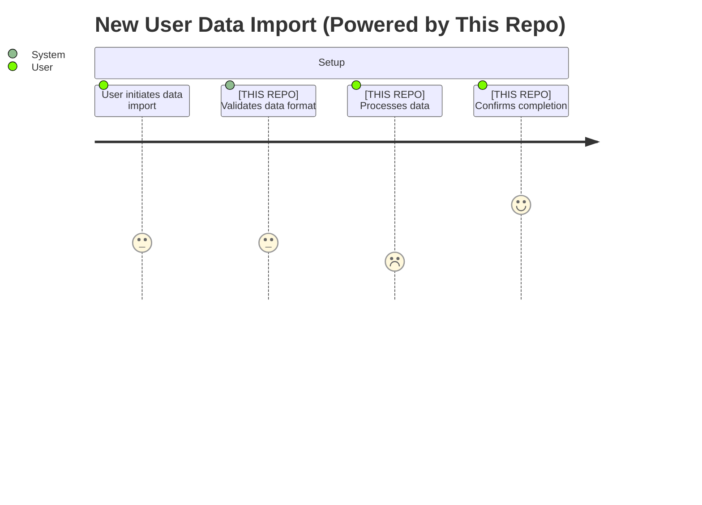

# Product Documentation

Generate docs/product.md documenting how THIS SPECIFIC REPOSITORY impacts user-facing features and user experience.

CRITICAL: Repository-Specific Focus**

This documentation is NOT about the overall product your company makes. It's about the specific product impact of THIS repository you're currently working in.

Before writing, you MUST:

1. Understand this repository's purpose (read README, explore code structure)
2. Identify what user-facing capabilities THIS repo enables
3. Determine if this is a frontend, backend, library, or other component
4. Document only the UX impacts that trace directly to THIS repo's code

## Scope

This document focuses on **how THIS SPECIFIC REPOSITORY impacts the user experience** of your product. Unlike a general product overview, this documentation explains:

- What user-facing features or capabilities does THIS repo enable or support?
- How do errors in THIS repo's code manifest as user experience problems?
- What product functionality would break if THIS repo failed?

**Start by understanding this repo's role**: Is it a frontend component library? A backend API service? A data processing pipeline? A shared utility library used by user-facing features? Your documentation should explain the product impact specific to this repo's purpose.

If this repo has no direct user-facing impact (e.g., it's purely internal tooling), state that clearly and explain what internal capabilities it provides that indirectly support user-facing features.

## Required Sections

### 1. Repository Product Impact Summary

- **Repository Purpose**: What does THIS repository do? (e.g., "Frontend component library", "Authentication service API", "Payment processing backend", "Admin dashboard")
- **User-Facing Scope**: Which parts of the overall product does this repo power? Be specific about what users see/interact with that comes from this repo.
- **End Users Affected**: Who experiences this repo's functionality? (end customers, internal admins, partners, etc.)
- **Key Product Capabilities Enabled**: What would users NOT be able to do if this repo didn't exist or was broken?

**Example**:

```md
## Repository Impact

**Repository**: payment-service
**User-Facing Scope**: This repo powers all payment processing, subscription management, and billing features in the product.
**End Users Affected**: Paying customers and finance team members
**Key Capabilities**: Users can purchase subscriptions, update payment methods, view invoices, and process refunds through features backed by this service.
```

### 2. User-Facing Features Powered by This Repo

Document each feature that THIS REPOSITORY enables or supports. Focus only on features where this repo's code directly contributes to user experience:

```md
### [Feature Name - e.g., "Real-time Metrics Aggregation"]

**What This Repo Provides**: The backend service that calculates and serves metrics data to the frontend dashboard.

**What Users See**: Users see real-time charts and statistics in the product dashboard (rendered by a different frontend repo, but powered by THIS repo's APIs).

**User Actions Enabled by This Repo**:
- View aggregate statistics across date ranges
- Filter data by category, status, or custom fields
- Export data to CSV/PDF formats (this repo generates the data)

**User Value from This Repo**: Users get accurate, up-to-date metrics without this repo needing to query the database repeatedly (this repo's caching layer improves performance).

**Implementation in This Repo**:
- API endpoints: src/api/controllers/analytics.ts
- Aggregation logic: src/services/metrics/aggregator.ts
- Caching: src/services/metrics/cache.ts

**Potential UX Bugs from Errors in This Repo**:
- **Incorrect calculations**: If aggregation logic in `src/services/metrics/aggregator.ts` has bugs, users see wrong numbers → loss of trust in product
- **Stale data**: If caching in `src/services/metrics/cache.ts` fails to invalidate, users see outdated metrics → poor decisions based on old data
- **API timeouts**: If export endpoint times out, users lose their work and have to restart → frustration and support tickets
- **Wrong data returned**: If filter logic doesn't properly combine parameters, users get unexpected results → confusion and wasted time
```

### 3. User Flows & This Repo's Role

Document critical user flows where THIS REPOSITORY plays a role. Highlight where this repo's code is involved in the user's journey:

**Example: First-Time User Onboarding (if this repo is involved)**

Only document flows where THIS repo participates:



**Critical UX Failure Points in This Repo:**

- If validation logic fails → User sees cryptic error, doesn't know how to fix their data
- If processing hangs → User abandons before seeing value, never returns
- If completion webhook fails → User unsure if import worked, may retry and create duplicates

**Example: Core Feature Flow Where This Repo Is Critical**

Only map the steps where THIS repository's code executes:

```txt
[Other repos handle login and navigation, not shown here]

3. User requests filtered data (THIS REPO: src/api/search.ts)
   ⚠️ Error here → User can't find their data, thinks it's missing

4. User exports results (THIS REPO: src/api/export.ts)
   ⚠️ Error here → User loses work, has to start over

[Other repos handle post-export actions, not shown here]
```

**Key Point**: Only document the parts of user flows where THIS repository's code is executing. Reference other repos/services when relevant but don't document their entire flow.

### 4. User Experience Impact Map for This Repo

Create a table mapping code components **in THIS repository** to their UX impact:

| Component/Module in This Repo | User-Facing Feature It Powers | Critical UX Impact if Broken | User Severity |
|-------------------------------|-------------------------------|------------------------------|---------------|
| src/api/search.ts | Search functionality in main product | Users can't find their content, think data is missing | High |
| src/services/email/ | Transactional email notifications | Users miss important updates, forget to take action | Medium |
| src/utils/formatting.ts | Data display across product | Numbers/dates show incorrectly, users misread data and make wrong decisions | High |
| src/api/export.ts | Data export feature | Users can't get their data out, feel locked in, support tickets increase | Medium |

**Note**: Only include components from THIS repository. If this is a backend service, map APIs to frontend features. If this is a frontend repo, map components to user interactions.

### 5. Data Integrity & User Trust in This Repo

**Critical Data Flows Handled by This Repo:**

Document where data accuracy **in THIS repository** is essential to user trust. Skip this section if this repo doesn't handle user data:

**Example (if this repo handles billing):**

```md
### Financial Calculations in This Repo

**Location in This Repo**: src/services/billing/calculator.ts

**User Impact**: Users see charges on their credit card matching what the product displays

**Trust Factor**: HIGH - Incorrect amounts cause immediate trust loss and support burden

**Potential Errors from This Repo**:
- Rounding errors in currency calculations → Users charged wrong amount
- Timezone bugs in subscription billing → Users charged on wrong date
- Proration logic errors → Users feel overcharged
- Currency conversion errors → International users see wrong amounts

**Testing Requirements**: THIS REPO's financial calculations must have 100% unit test coverage with edge cases
```

**Example (if this repo handles user data display):**

```md
### User Data Accuracy in This Repo

**Location in This Repo**: src/api/user-data.ts

**User Impact**: Users see correct personal information in the product UI (rendered by frontend repo using data from THIS repo's API)

**Trust Factor**: MEDIUM - Errors cause confusion but usually recoverable

**Potential Errors from This Repo**:
- Wrong user data returned from API (cache key collision) → Privacy violation, user panic
- Stale profile data due to cache → Users think changes didn't save
- Incorrect timezone formatting → Users misread timestamps across the product
```

**Adapt to your repo**: Document only the data integrity concerns relevant to THIS repository's scope.

### 6. Performance Impact from This Repo

**How This Repo Affects User-Perceived Performance:**

Only document performance issues that originate from THIS repository's code:

| Performance Issue from This Repo | User Experience Impact | Caused By (in this repo) |
|----------------------------------|------------------------|--------------------------|
| API endpoint latency >1s | Users perceive product as slow, may abandon feature | Unoptimized database queries in src/models/ |
| Large payload responses | Slow page load, poor mobile experience | Missing pagination or field filtering in src/api/ |
| Memory leaks in background jobs | Degrading performance over time, eventual crashes | Improper cleanup in src/workers/ |
| Cache stampede on invalidation | Periodic slowdowns when many users hit uncached data | Missing cache warming in src/cache/ |

**Implementation Areas in This Repo:**

- API response time: src/api/middleware/caching.ts
- Database query optimization: src/models/
- Background job efficiency: src/workers/

**Note**: If this is a frontend repo, focus on bundle size, render performance, and network request optimization. If it's a backend repo, focus on API latency, database queries, and throughput.

### 7. Error Handling & User Communication from This Repo

**User-Visible Errors Originating from This Repo:**

Document how errors in THIS repository's code surface to users:

**Example (if this repo handles data validation):**

```md
### Validation Errors from This Repo

**User Scenario**: User submits data that this repo's API validates

**This Repo's Role**: src/api/validators/ checks input and returns error messages

**Current Behavior**: (Document what error responses this repo sends)
**Ideal Behavior**: Clear, actionable error messages with field-level specificity

**UX Impact if This Repo's Error Handling is Broken**:
- Cryptic error codes (500, ERR_UNKNOWN) → Users don't know what went wrong, submit support tickets
- Generic error messages → Users don't know which field to fix
- Errors without error codes → Frontend can't provide localized messages
- Missing field validation → Bad data gets stored, causes problems later
```

**Example (if this repo has external dependencies):**

```md
### Third-Party Service Failures

**User Scenario**: This repo calls external service (payment processor, email provider) that fails

**This Repo's Role**: src/services/external/ handles external API calls

**Current Behavior**: (Document how this repo handles external failures)
**Ideal Behavior**: Graceful degradation with clear user messaging

**UX Impact if This Repo's Error Handling is Broken**:
- Users see technical stack traces → Appears unprofessional, scary
- Timeouts without retries → Users can't complete critical actions (e.g., can't pay)
- No user-friendly error message → Users think the product is broken
```

**Adapt to your repo**: Only document error scenarios where THIS repository's error handling code is responsible for the user experience.

### 8. Edge Cases & User Pain Points in This Repo

**Known UX Challenges Caused by This Repo:**

Only document edge cases and pain points that stem from THIS repository's implementation:

- **Bulk Operations** (if this repo handles them): When users process 100+ items, THIS repo's API becomes slow/unresponsive (see src/api/bulk-operations.ts) → Users experience timeouts and have to retry
- **Concurrent Edits** (if this repo manages state): Multiple users editing same resource causes conflicts due to THIS repo's locking mechanism (see src/services/conflict-resolution.ts) → Users lose work or see "resource locked" errors
- **Large Data Sets** (if applicable): When users have 10,000+ records, THIS repo's queries become slow (see src/models/queries.ts) → Users experience poor performance
- **Rate Limiting** (if this repo enforces it): Heavy users hit rate limits in THIS repo's middleware (see src/middleware/rate-limit.ts) → Users can't complete tasks, see "too many requests" errors

**Skip this section** if this repo doesn't have notable edge cases or user pain points.

### 9. Accessibility Considerations for This Repo

**How Errors in This Repo Affect Accessible UX:**

Only include if THIS repository has accessibility-related code (most relevant for frontend repos):

| Feature in This Repo | Accessibility Requirement | Code Location in This Repo | Impact if Broken |
|----------------------|---------------------------|----------------------------|------------------|
| Form validation | Clear error messages in API responses | src/api/validators/ | Screen reader users don't get actionable error feedback |
| Data structure | Logical ordering in API responses | src/api/serializers/ | Screen reader users experience illogical navigation order |
| Error responses | Semantic HTTP status codes | src/middleware/errors.ts | Assistive tech can't differentiate error types |

**Note**: Most accessibility concerns are in frontend code. If this is a backend repo, focus on how your API responses support accessible frontend implementation (proper error messages, semantic status codes, logical data ordering, etc.). If this repo has no accessibility impact, skip this section.

### 10. User Feedback & Common Complaints Related to This Repo

**Link Technical Issues in This Repo to User Complaints:**

Only document complaints that trace back to THIS repository's code:

```md
### "The [feature] is always wrong/slow/broken"

**User Complaint Pattern**: (Document the complaint if you have data)

**Root Cause in This Repo**: (e.g., Race condition in src/services/aggregator.ts:145)

**How This Repo Contributes to the Issue**:
1. This repo's background job processes data asynchronously
2. Frontend queries this repo's API before processing completes
3. This repo returns stale/incomplete data
4. User sees incorrect information in the product

**Fix Required in This Repo**: Add proper job completion signaling or return 202 status until ready
```

**Note**: If you don't have specific user feedback data tied to this repo, skip this section or state "No known user complaints specific to this repository at this time."

### 11. Failure Modes & Recovery for This Repo

**User-Facing Failure Scenarios Involving This Repo:**

Only document failures that originate in THIS repository:

**Example:**

```md
### [Critical Operation] Failure in This Repo

**User Experience**: What the user experiences when THIS repo fails

**Critical Path Involving This Repo**: (Frontend/other service) → THIS REPO's endpoint → External dependency

**Potential Failure Points in This Repo**:
- This repo's API timeout → User sees error, unsure if action completed
- This repo's database write failure → User's action not recorded, may retry and create duplicates
- This repo fails to send event to message queue → Downstream systems don't process user's action

**This Repo's Recovery Mechanisms**: (Document retry logic, transaction rollbacks, idempotency, etc.)
**User Recovery Path**: Can user retry? Does this repo handle idempotency? What does user need to do?
**Support Burden**: HIGH/MEDIUM/LOW - How often does support need to manually intervene due to this repo's failures?
```

**Adapt to your repo**: Focus on failure modes where THIS repository is the point of failure, not failures in other systems.

## Formatting Guidelines

- Use Mermaid user journey diagrams for user flows
- Create impact/severity tables for prioritizing fixes
- Include file paths to relevant code
- Link to related documentation (features.md, api_design.md)
- Use real user complaint examples if available
- Highlight CRITICAL vs HIGH vs MEDIUM severity for user impact

## What NOT to Include

- **Features from other repositories**: Only document what THIS repo contributes to the user experience
- **Overall product overviews**: Don't describe the entire application; focus on this repo's specific impact
- **Technical architecture details**: That's architecture.md (save internal technical details for that doc)
- **Complete API specifications**: That's api_design.md (only reference APIs that affect UX)
- **Database schemas**: That's data_model.md (only mention data accuracy concerns)
- **Internal business logic**: That's features.md (focus on user-visible behavior, not internal rules)
- **Implementation code**: Don't include code snippets; just reference file locations

## Output

Write the complete document to `docs/product.md` following this structure, **focusing specifically on how THIS REPOSITORY impacts user experience** and how errors in THIS repo's code manifest as UX problems.

**Key Principles**:

1. **Repo-specific focus**: Every section should be about THIS repository's product impact
2. **User-facing only**: Skip sections that don't apply if this repo has no user-facing impact
3. **Concrete examples**: Use actual file paths and code locations from THIS repo
4. **Clear boundaries**: When other repos/services are involved, clearly delineate where this repo's responsibility begins and ends

**Before you start writing**:

- Explore the codebase to understand this repo's purpose and scope
- Identify what user-facing features this repo enables or supports
- Determine if this is a frontend, backend, shared library, or other type of repo
- Adapt sections based on the repo type (e.g., skip accessibility if it's a backend API)

**IMPORTANT - Last Updated Header:**

Before writing the document, run the following bash command to get the current date:

```bash
date +"%B %d, %Y"
```

Add a "Last Updated" header at the very top of the document using the date from the bash command:

```md
# Product Documentation

**Last Updated:** [Date from bash command]

[Rest of document content...]
```
